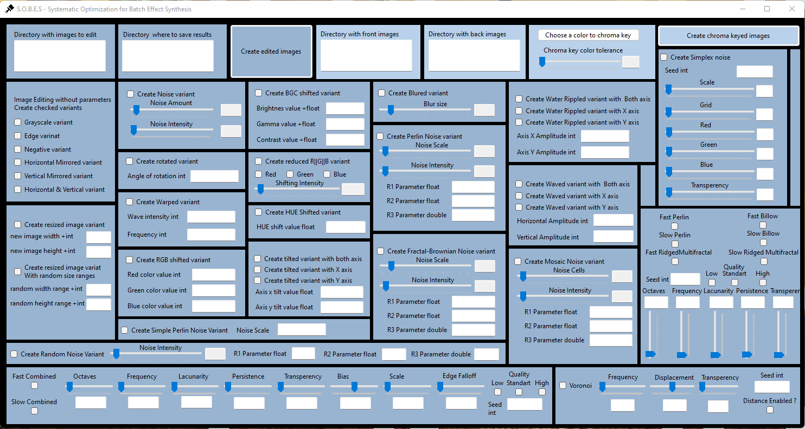

# Image Effects Program

This program allows you to apply various custom effects to images in bulk.
I made it to augment images for training neural networks.
Each pack of edited images saves separatly.
You can use it freely as you want.

## Materials Used

When creating this program, I used the following materials:

- [SimplexNoise by WardBenjamin](https://github.com/WardBenjamin/SimplexNoise?tab=readme-ov-file)
- [SharpNoise by rthome](https://github.com/rthome/SharpNoise/tree/master)
- [LibNoise by CalmBit](https://github.com/CalmBit/LibNoise)
- [NoiseEngine by SommerEngineering](https://github.com/SommerEngineering/NoiseEngine)
- [The Book of Shaders](https://thebookofshaders.com/11/?lan=ru)
- [StackOverflow: How to apply blur effect on a bitmap image in C#](https://stackoverflow.com/questions/44827093/how-to-apply-blur-effect-on-a-bitmap-image-in-c)

## S.O.B.E.S. can create:

- Grayscale
- Edge
- Negative
- Mirror Horizontal
- Mirror Vertical
- Mirror H&V
- Resize Fixed
- Resize Random
- Noise
- Rotate
- Warp
- RGB Shifted
- Simple Perlin Noise
- Random Noise
- BGC Shifted
- Reduce R |G||B
- HUE Shifted
- Tilted in X or Y or X&Y Axis
- Blur
- Perlin Noise
- Fractal-Brownian Noise
- Chroma Key with Back and Front Images
- Ripple in X or Y or X&Y Axis
- Wave X or Y or X&Y Axis
- Mosaic Noise
- Simplex Noise
- Alternative Fast and Slow Perlin Noise
- Fast and Slow Billow Noise
- Fast and Slow Ridged Multifractal Noise
- Fast and Slow Combined Noise
- Voronoi Noise

### Download

If you need the `.exe` file, you can download it from the [release section]([link-to-release-section](https://github.com/maksimiec/SOBES/releases/tag/v0.1)) of the repository.

